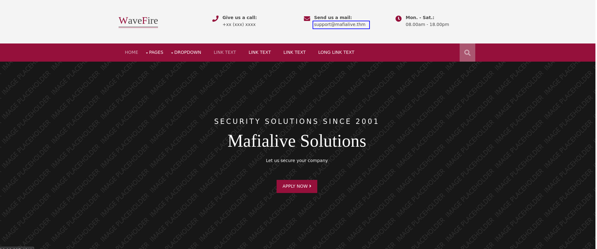

# Archangel

## Enumeration

### NMAP

The first step to understanding what we are attacking is to determine what ports the target has open and see what service we can find.  

Command:

```bash
nmap -A -p- -oN nmap/all_port_aggressive $TARGET
```

Results:

```bash
Nmap scan report for 10.10.227.48
Host is up (0.082s latency).
Not shown: 65533 closed ports
PORT   STATE SERVICE VERSION
22/tcp open  ssh     OpenSSH 7.6p1 Ubuntu 4ubuntu0.3 (Ubuntu Linux; protocol 2.0)
| ssh-hostkey: 
|   2048 9f:1d:2c:9d:6c:a4:0e:46:40:50:6f:ed:cf:1c:f3:8c (RSA)
|   256 63:73:27:c7:61:04:25:6a:08:70:7a:36:b2:f2:84:0d (ECDSA)
|_  256 b6:4e:d2:9c:37:85:d6:76:53:e8:c4:e0:48:1c:ae:6c (ED25519)
80/tcp open  http    Apache httpd 2.4.29 ((Ubuntu))
|_http-server-header: Apache/2.4.29 (Ubuntu)
|_http-title: Wavefire
Aggressive OS guesses: Linux 3.1 (95%), Linux 3.2 (95%), AXIS 210A or 211 Network Camera (Linux 2.6.17) (94%), ASUS RT-N56U WAP (Linux 3.4) (93%), Linux 3.16 (93%), Linux 2.6.32 (92%), Linux 2.6.39 - 3.2 (92%), Linux 3.1 - 3.2 (92%), Linux 3.2 - 4.9 (92%), Linux 3.7 - 3.10 (92%)
No exact OS matches for host (test conditions non-ideal).
Network Distance: 4 hops
Service Info: OS: Linux; CPE: cpe:/o:linux:linux_kernel

TRACEROUTE (using port 80/tcp)
HOP RTT      ADDRESS
1   18.25 ms 10.6.0.1
2   ... 3
4   82.34 ms 10.10.227.48

OS and Service detection performed. Please report any incorrect results at https://nmap.org/submit/ .
Nmap done: 1 IP address (1 host up) scanned in 288.32 seconds
```

### Website (Manual)

Not everything about enumeration can be automated, so we should look at the site being hosted by the target and see if we can discover any more information. One thing that stands out almost immediately is the domain mentioned in the `Send us a mail:` prompt at the top of the page. We can add this to `/etc/hosts` to see if there is virtual hosting being done on the target. If there is, then adding this to the `/etc/hosts` file and navigating to `http://mafialive.thm` will bring us to a different site.



