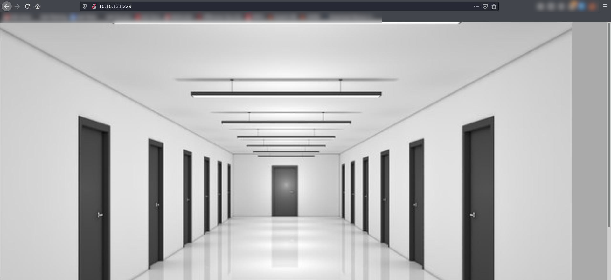
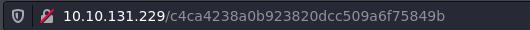

# Corridor

## Enumeration

As always, the first step is to enumerate the machine we are attacking. We check for open ports using NMAP and the following command:

```bash
sudo nmap -A -p- -oN nmap/all_ports_aggressive $TARGET
```

Output:

```bash
Nmap scan report for 10.10.131.229
Host is up (0.083s latency).
Not shown: 65534 closed ports
PORT   STATE SERVICE VERSION
80/tcp open  http    Werkzeug httpd 2.0.3 (Python 3.10.2)
|_http-server-header: Werkzeug/2.0.3 Python/3.10.2
|_http-title: Corridor
No exact OS matches for host (If you know what OS is running on it, see https://nmap.org/submit/ ).
TCP/IP fingerprint:
OS:SCAN(V=7.91%E=4%D=2/14%OT=80%CT=1%CU=37964%PV=Y%DS=4%DC=T%G=Y%TM=63EC23D
OS:7%P=x86_64-pc-linux-gnu)SEQ(SP=102%GCD=1%ISR=10D%TI=Z%CI=Z%II=I%TS=A)OPS
OS:(O1=M506ST11NW6%O2=M506ST11NW6%O3=M506NNT11NW6%O4=M506ST11NW6%O5=M506ST1
OS:1NW6%O6=M506ST11)WIN(W1=FE88%W2=FE88%W3=FE88%W4=FE88%W5=FE88%W6=FE88)ECN
OS:(R=Y%DF=Y%T=3F%W=FAF0%O=M506NNSNW6%CC=Y%Q=)T1(R=Y%DF=Y%T=3F%S=O%A=S+%F=A
OS:S%RD=0%Q=)T2(R=N)T3(R=N)T4(R=Y%DF=Y%T=3F%W=0%S=A%A=Z%F=R%O=%RD=0%Q=)T5(R
OS:=Y%DF=Y%T=40%W=0%S=Z%A=S+%F=AR%O=%RD=0%Q=)T6(R=Y%DF=Y%T=40%W=0%S=A%A=Z%F
OS:=R%O=%RD=0%Q=)T7(R=Y%DF=Y%T=40%W=0%S=Z%A=S+%F=AR%O=%RD=0%Q=)U1(R=Y%DF=N%
OS:T=40%IPL=164%UN=0%RIPL=G%RID=G%RIPCK=G%RUCK=G%RUD=G)IE(R=Y%DFI=N%T=40%CD
OS:=S)

Network Distance: 4 hops

TRACEROUTE (using port 1025/tcp)
HOP RTT      ADDRESS
1   17.33 ms 10.6.0.1
2   ... 3
4   82.80 ms 10.10.131.229

OS and Service detection performed. Please report any incorrect results at https://nmap.org/submit/ .
Nmap done: 1 IP address (1 host up) scanned in 60.56 seconds
```

When we navigate to the web page being hosted on port 80, we discover a picture of a hallway, whose doors can be clicked on.



## IDOR

By inspecting the URL for each door we click on, it looks like the `GUID` for each room is an MD5 hash. This hash may be the hash of the room number, meaning we can easliy forge a hash and attempt to gain access to a room that is not shown. 



Running any of suspected hashes through [crackstation](crackstation.net) or a hash cracker will confirm our suspicion that the `GUID` from the URL is just an MD5 of the room number.

The left-closest room's hash is cracked and reveals that the left-closest room has the ID of 1, adn the right-closest room has the ID of 8. With this information, the next logical numbers to test are `0` and `9`. By taking the MD5 of `0` and `9` and using them in the URL, instead, we discover that the "secret" room is room number `0`. 

## Automated Tools

1. [Python Version](exploit.py) 
2. [Golang Version](exploit.go) 