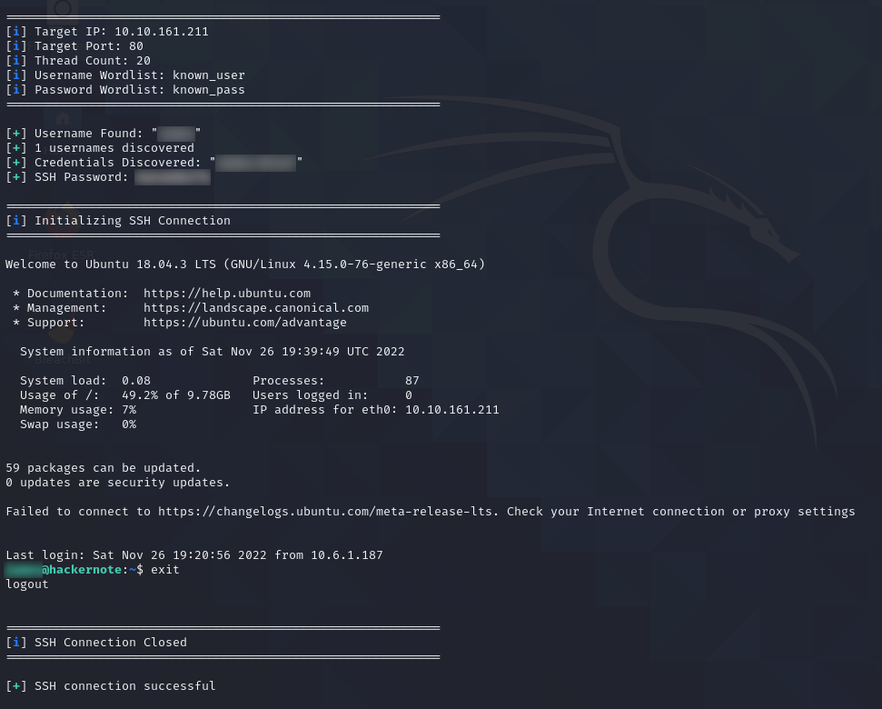

# find_users.go

## Description

This program is written in `Golang` and designed to brute-force valid usernames using a timing attack. This is designed to be faster than the `Python3` implementation of the brute-force attack because it is multi-threaded via the use of go routines. 

If login credentials are discovered, the program automatically logs into the site, and pulls down the SSH credentials from the restricted area.

Once the SSH credentials are pulled down, `find_users.go` automatically creates an SSH connection with the target and spawns a stable shell for the attacker.

*Note: The maximum number of go routines is limited to 50 to reduce the chances of DoS'ing the target.*

## Command-Line Arguments

1. `-i` : IP address (or domain) of target machine.
2. `-l`: Attempt to brute-force password of discovered user(s).
3. `-p`: Port used to communicate with target.
4. `-t`: Number of threads to spawn during brute-force attempt.
5. `-P`: Wordlist to use for password brute-force attempt.
6. `-U`: Wordlist to use for username brute-force attempt.

## Defaults

1. Target IP: `127.0.0.1`
2. Target Port: `80`
3. Thread Count: 10
4. Wordlist Name: `names_short.txt`

## Build Command

There are two ways to run this program as main. The first is to run it using `go run` and requires the machine this is being executed on to have `Golang` installed. The second way is to compile it into a binary (or "executable" in Windows land) and run it using `./find_users`. To compile this into a binary, run the following command:

```bash
go build find_users.go
```

## Example Calls

*Note: `$TARGET` is an environment variable holding the IP address of the target machine. To set this variable in your environment, enter `export TARGET=<target_ip>` in the terminal.*

Attack Target Using Defaults:

```bash
./find_users -i $TARGET
```

Attack Target On Non-Default Port:

```bash
./find_users -i $TARGET -p <port_number>
```

Attack Target Using 50 Threads:

```bash
./find_users -i $TARGET -t 50
```

Attack Target Using Non-Default Wordlist:

```bash
./find_users -i $TARGET -U <path_to_wordlist>
```

Attack Target And Attempt To Brute Password:

```bash
./find_users -i $TARGET -P <path_to_wordlist> -l
```

## Eaxmple Run

The following screenshot was taken during an execution of the program, with the `-l` option specified. Upon gaining the user credentials, it logged into the target, grabbed the SSH credentials, and opened an SSH connection  with the target machine.

