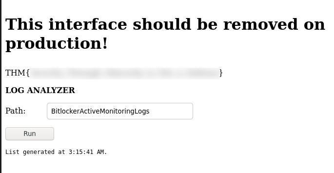
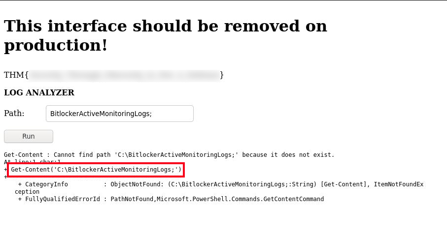
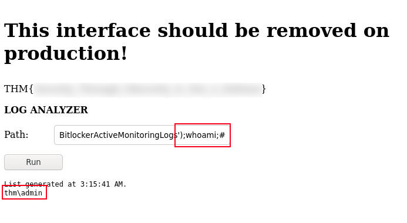
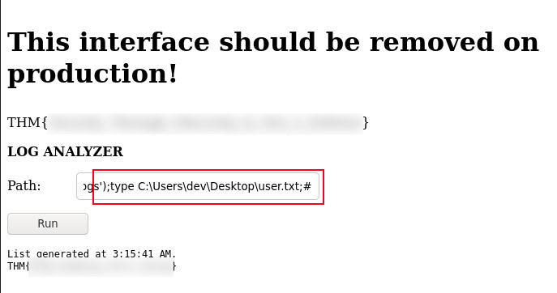

# Lookback


## Enumeration 

### NMAP

Command:

```bash
nmap -A -p- -Pn -oN nmap/all_port_aggressive $TARGET
```

Output:

```bash
Host is up (0.11s latency).
Not shown: 65532 filtered ports
PORT     STATE SERVICE       VERSION
80/tcp   open  http          Microsoft IIS httpd 10.0
|_http-server-header: Microsoft-IIS/10.0
|_http-title: Site doesn't have a title.
443/tcp  open  ssl/https
|_http-server-header: Microsoft-IIS/10.0
| http-title: Outlook
|_Requested resource was https://10.10.135.223/owa/auth/logon.aspx?url=https%3a%2f%2f10.10.135.223%2fowa%2f&reason=0
| ssl-cert: Subject: commonName=WIN-12OUO7A66M7
| Subject Alternative Name: DNS:WIN-12OUO7A66M7, DNS:WIN-12OUO7A66M7.thm.local
| Not valid before: 2023-01-25T21:34:02
|_Not valid after:  2028-01-25T21:34:02
3389/tcp open  ms-wbt-server Microsoft Terminal Services
| rdp-ntlm-info: 
|   Target_Name: THM
|   NetBIOS_Domain_Name: THM
|   NetBIOS_Computer_Name: WIN-12OUO7A66M7
|   DNS_Domain_Name: thm.local
|   DNS_Computer_Name: WIN-12OUO7A66M7.thm.local
|   DNS_Tree_Name: thm.local
|   Product_Version: 10.0.17763
|_  System_Time: 2023-04-05T21:54:02+00:00
| ssl-cert: Subject: commonName=WIN-12OUO7A66M7.thm.local
| Not valid before: 2023-01-25T21:12:51
|_Not valid after:  2023-07-27T21:12:51
Warning: OSScan results may be unreliable because we could not find at least 1 open and 1 closed port
OS fingerprint not ideal because: Missing a closed TCP port so results incomplete
No OS matches for host
Network Distance: 4 hops
Service Info: OS: Windows; CPE: cpe:/o:microsoft:windows

Host script results:
|_clock-skew: -1s
```

NMAP reveals three ports open, two web ports and one remote desktop port. The two web ports hold the most promise for compromise.

### FFUF

Command:

```bash
ffuf -w raft-large-words.txt -u http://$TARGET$/FUZZ -o ffuf/dir_fuzz -of html --fs 0
```

Discovered:

```bash
http://$TARGET/test
```

The FFUF scan reveals a `test` directory/route that can be accessed. Navigating to this location via HTTP gives a `403 Forbidden` message. However, accessing the `/test/` route via HTTPS prompts us for a password.

### Nikto

Command:

```bash
nikto -h http://$TARGET -output nikto/nikto_scan_http.txt
```

Output:

```bash
+ Target Host: 10.10.135.223
+ Target Port: 80
+ GET The anti-clickjacking X-Frame-Options header is not present.
+ GET The X-XSS-Protection header is not defined. This header can hint to the user agent to protect against some forms of XSS
+ GET The X-Content-Type-Options header is not set. This could allow the user agent to render the content of the site in a different fashion to the MIME type
+ GET Retrieved x-powered-by header: ASP.NET
+ GET Uncommon header 'x-feserver' found, with contents: WIN-12OUO7A66M7
+ GET Uncommon header 'request-id' found, with contents: bab7f958-5b07-43bc-89ae-29cf16886e32
+ GET Default account found for '' at /Rpc (ID <REDACTED>, PW <REDACTED>). Generic account discovered..
```

The Nikto scan reveals default credentials for the site that we can use to login to `/test/`.

## RCE

Upon logging into `/test`, we are presented with a page that allows us to view the last time a log was generated by placing the log filename into a text input. This also provides us the first flag.

 

This text input looks promising, because it feels like it is interacting directly with a Command Prompt or PowerShell. If we insert a `;` at the end of the filename, we get confirmation that the value input into this box is being passed to a PowerShell. This error also provides us the information needed for Remote Code Execution (RCE), becuase it shows us the entire command being processed. 



Adding `');` to the end of the filename will allow us to execute commands via this input box. We just need to make sure to comment out the rest of the command by adding a `;#` to the end of our input.



Utilizing this knowledge, we can then upload a reverse shell or cat the flag directly from the browser.




### RCE Automation

There are two programs I have created that will automate the RCE exploitation. One program is written in Python3 and the other in Golang. The Python3 exploit can be found [here](rce.py) and the Golang exploit [here](rce.go).  

The Golang exploit can either be run using the `go run` command or compiling the binary using `go build` command. This contains a built-in file server that will be spun up if the user provides a C2 IP address. If a C2 address is provided, it is assumed the user is attempting to upload a reverse shell/meterpreter payload to the target and this program removes the need to manually spin up a local file server.